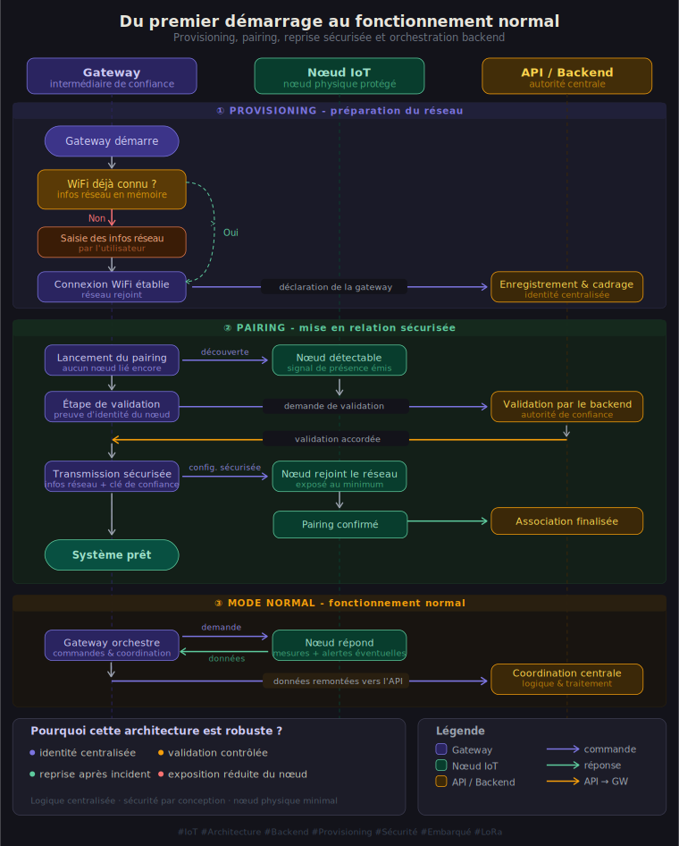

 

# EauSûre Firmware

Firmware embarqué des deux composants physiques principaux de la solution EauSûre :
- `IoT_Node/` : nœud de mesure ESP32-S3 ;
- `Gateway_Node/` : passerelle ESP32.

Ce dépôt couvre la logique embarquée de mesure, de communication radio sécurisée, de provisioning, d'appairage, de supervision et de mise à jour firmware.

## Portée

Dans l'architecture EauSûre :
- le **nœud de mesure** acquiert les données de qualité d'eau, détecte les événements critiques et dialogue avec la passerelle en LoRa chiffré ;
- la **passerelle** assure la connectivité Wi-Fi, les échanges API/MQTT, le provisioning BLE, l'appairage des nœuds, la télémétrie cloud et l'orchestration des campagnes OTA/FUOTA.

Le firmware s'inscrit donc au cœur du système embarqué, entre le matériel terrain et la plateforme cloud.

## Stack

- Arduino / ESP32
- FreeRTOS
- LoRa point-à-point sécurisé
- BLE pour le provisioning passerelle
- Wi-Fi local pour l'appairage du nœud
- MQTT pour les commandes et retours temps réel
- HTTPS / API backend pour provisioning, heartbeat et télémétrie
- FUOTA pour les mises à jour du nœud

## Organisation du dépôt

- [IoT_Node](IoT_Node)
  - firmware du nœud de mesure ESP32-S3
- [Gateway_Node](Gateway_Node)
  - firmware de la passerelle ESP32

## IoT Node

Le nœud de mesure est responsable de :
- lire pH, TDS, turbidité, température, batterie et données inertielles ;
- détecter les événements de type `SHAKE` ;
- afficher l'état local sur OLED et RGB ;
- répondre aux commandes passerelle ;
- exposer un point d'accès Wi-Fi temporaire pendant l'appairage initial ;
- recevoir et appliquer des mises à jour FUOTA.

Fichiers clés :
- `IoT_Node.ino`
- `app_state.*`
- `pairing_mode.*`
- `pairing_store.*`
- `lora_radio.*`
- `task_sensors.*`
- `task_control.*`
- `task_mpu.*`
- `task_display.*`
- `display_oled.*`
- `firmware_version.*`

## Gateway Node

La passerelle est responsable de :
- recevoir les credentials Wi-Fi via BLE ;
- provisionner la passerelle côté cloud ;
- découvrir et appairer les nœuds voisins ;
- transmettre les commandes LoRa ;
- recevoir, valider et router les charges utiles chiffrées ;
- synchroniser les commandes MQTT ;
- pousser les données vers le backend ;
- déclencher les alertes locales ;
- orchestrer OTA passerelle et FUOTA nœud.

Fichiers clés :
- `Gateway_Node.ino`
- `normal_mode.*`
- `provisioning_mode.*`
- `ble_provisioning.*`
- `wifi_store.*`
- `node_pairing_mode.*`
- `node_pairing_store.*`
- `mqtt_gateway.*`
- `api_client.*`
- `wifi_manager.*`
- `lora_radio.*`
- `fuota_manager.*`
- `fuota_job_store.*`
- `telemetry.*`
- `audio_alert.*`
- `sd_logger.*`

## Protocole LoRa actuel

Les types de trames actuellement définis entre passerelle et nœud sont :

| Type | Direction | Signification |
|------|-----------|---------------|
| `0x01` | Node -> Gateway | `DATA` (`MEASURE_RESP` ou `SHAKE_ALERT`) |
| `0x02` | Both | `ACK` |
| `0x03` | Gateway -> Node | `MEASURE_REQ` |
| `0x04` | Gateway -> Node | `HEARTBEAT_REQ` |
| `0x05` | Node -> Gateway | `HEARTBEAT_ACK` |
| `0x06` | Gateway -> Node | `ACTIVATE` |
| `0x07` | Node -> Gateway | `ACTIVATE_OK` |
| `0x08` | Gateway -> Node | `SET_CONFIG` |
| `0x09` | Gateway -> Node | `UNPAIR` |
| `0x0A` | Gateway -> Node | `SLEEP` |
| `0x0B` | Gateway -> Node | `FUOTA_BEGIN` |
| `0x0C` | Gateway -> Node | `FUOTA_CHUNK` |
| `0x0D` | Gateway -> Node | `FUOTA_END` |
| `0x0E` | Gateway -> Node | `FUOTA_COMMIT` |

Caractéristiques du protocole :
- chiffrement authentifié `AES-128-GCM`
- validation `CRC-16`
- protection anti-rejeu par compteur de séquence
- évitement de collision basé sur `CAD`

### Structure détaillée de la trame LoRa

Pour garantir la sécurité, la fiabilité et la conformité aux contraintes de la bande ISM (fréquence **433 MHz**), chaque trame du protocole EauSûre suit une structure binaire rigoureuse d'une taille maximale de **222 octets** :

*   **En-tête (Header) en clair (24 octets) :** Contient les informations indispensables au routage et à la validation : version du protocole, type de message (`MsgType`), identifiant du dispositif (`Device ID`), numéro de séquence anti-rejeu (`seq`), nonce de chiffrement et taille de la charge utile.
    *   *Sécurité (AAD) :* L'en-tête voyage non chiffré pour permettre un traitement rapide, mais il est intégré au calcul du tag AES-GCM en tant que **Données Authentifiées Supplémentaires (AAD)**. Toute altération en transit invalidera le tag et provoquera le rejet de la trame.
*   **Payload chiffré (0 à 180 octets) :** Contient les données applicatives (mesures de qualité d'eau, configurations, chunks de FUOTA), chiffrées de bout en bout en **AES-128-GCM**.
*   **Tag GCM (16 octets) :** Le tag d'authentification cryptographique garantissant l'intégrité absolue et l'authenticité de la trame.
*   **CRC-16 Logiciel (2 octets) :** Calculé par le firmware de l'émetteur et vérifié par le récepteur, offrant un second niveau d'intégrité de bout en bout en plus du CRC matériel du transceiver radio **SX1278**.

  

## Provisioning et appairage

Pour passer d'un état initial "sortie d'usine" à un fonctionnement nominal sécurisé, le système EauSûre met en œuvre un cycle de vie rigoureux divisé en trois phases principales (illustrées par le diagramme ci-dessous) :

### 1. Mise en service de la passerelle (BLE Provisioning)
Lorsque la passerelle démarre pour la première fois et qu'aucun identifiant Wi-Fi n'est enregistré en mémoire non volatile (NVS) :
1.  **Mode Provisioning :** La passerelle active son interface Bluetooth Low Energy (BLE) et diffuse son identifiant accompagnée d'un challenge à usage unique (anti-rejeu).
2.  **Transmission cryptée :** L'application mobile récupère le secret de la passerelle depuis le cloud, dérive une clé de chiffrement et une clé de signature via **HMAC-SHA256**, puis envoie de façon sécurisée les identifiants Wi-Fi et le jeton d'authentification utilisateur.
3.  **Connexion & Sauvegarde :** La passerelle déchiffre les paramètres, valide le challenge, teste la connexion Wi-Fi et sauvegarde les credentials. Elle libère ensuite entièrement la pile BLE en RAM pour libérer de la mémoire vive pour la suite.

### 2. Appairage du nœud de mesure (Wi-Fi Local Pairing)
Une fois la passerelle connectée à Internet, elle doit s'associer avec le nœud de mesure local :
1.  **Point d'accès temporaire :** Le nœud démarre en mode **SoftAP** et crée un réseau Wi-Fi local nommé `IOT-<NODE_ID>`, protégé par une clé dérivée de son secret matériel unique.
2.  **Scan & Connexion :** La passerelle scanne l'environnement, se connecte au SoftAP du nœud grâce à la clé d'appairage récupérée via MQTT, puis interroge le nœud (routes `/identity` et `/prove`).
3.  **Preuve Cryptographique :** Le nœud génère une preuve de légitimité signée par HMAC-SHA256 que la passerelle transmet au backend pour validation.
4.  **Échange de clés :** Une fois validé par le cloud, un jeton cryptographique temporaire est transmis au nœud (via `/provision`), lui ordonnant de rejoindre le réseau Wi-Fi local en mode **STA** (Station).
5.  **Clé AES définitive :** Le nœud (via HTTPS) et la passerelle (via MQTT) récupèrent auprès du cloud la **clé AES de session LoRa définitive** qu'ils enregistrent localement en flash.

### 3. Transition vers le Mode Normal
Pour assurer la stabilité et une faible consommation :
*   Le nœud détruit sa tâche serveur HTTP locale, coupe le Wi-Fi local et bascule sur le protocole radio **LoRa chiffré**. Il passe la majorité de son temps en veille profonde (Deep Sleep).
*   La passerelle désactive toutes les tâches d'appairage temporaires et alloue ses ressources aux connexions **MQTT(S)** sécurisées et au traitement audio local.

Le flux complet des transitions d'états et le cycle de vie du système sont représentés dans le schéma ci-dessous :

  

## Runtime nominal

En fonctionnement nominal :
- la passerelle réactive le nœud via `ACTIVATE` ;
- elle pilote les fenêtres de réveil avec `MEASURE_REQ`, `HEARTBEAT_REQ` et `SLEEP` ;
- le nœud répond avec des trames `DATA` ou `HEARTBEAT_ACK` ;
- la passerelle relaie ensuite les mesures vers le cloud et MQTT ;
- en cas de `SHAKE`, une fenêtre de suivi spécifique est ouverte.

## FUOTA 

Le firmware supporte désormais :
- le téléchargement de firmware côté passerelle ;
- la persistance d'un job FUOTA entre redémarrages ;
- le transfert LoRa fragmenté vers le nœud ;
- le commit différé du nouveau firmware ;
- le reporting d'état vers MQTT / backend.

## Configuration

Créer `config.h` à partir des templates :
- `IoT_Node/config.h.template`
- `Gateway_Node/config.h.template`

## Compilation

- `IoT_Node/` cible une carte `ESP32-S3`
- `Gateway_Node/` cible une passerelle `ESP32`
- ouvrir chaque `.ino` dans Arduino IDE ou PlatformIO avec les bibliothèques requises
