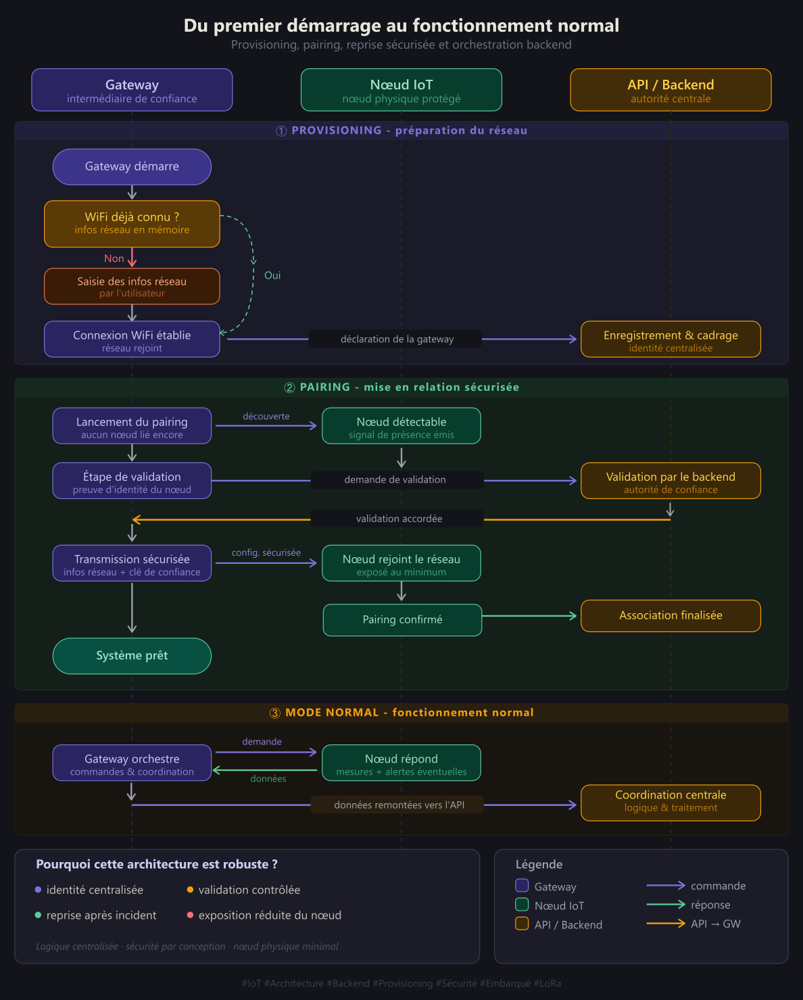
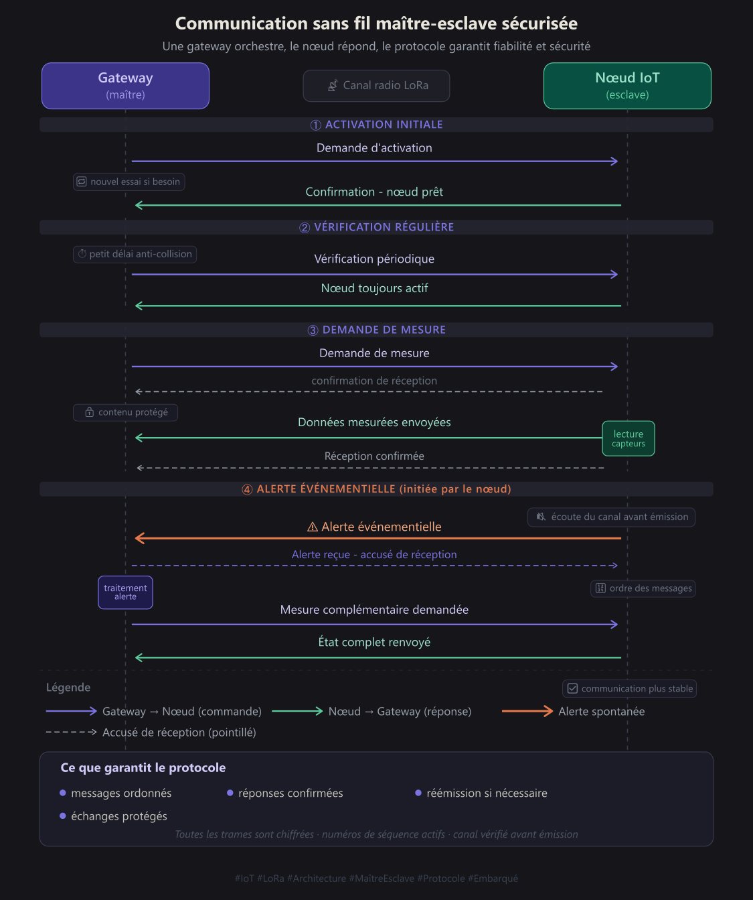

# IoT Water Quality Monitoring over LoRa

This repository contains the firmware for the two embedded components of the system:

- `IoT_Node/`: ESP32-S3 sensor node
- `Gateway_Node/`: ESP32 gateway

The sensor node collects water-quality and device-health data, then sends it to the gateway over encrypted LoRa. The gateway handles provisioning, pairing, telemetry forwarding, and alerting.

## System Overview

### `IoT_Node/`

The IoT node is responsible for:

- reading pH, TDS, turbidity, water temperature, battery, and MPU data
- detecting shake events
- showing local status on the OLED display
- replying to gateway commands over LoRa
- supporting first-time pairing through a temporary WiFi access point

Main files:

| File | Role |
|------|------|
| `IoT_Node.ino` | Boot flow and mode selection |
| `app_state.*` | Shared runtime state, sensor helpers, crypto helpers |
| `pairing_mode.*` | WiFi AP pairing flow and HTTP endpoints |
| `pairing_store.*` | Persistent pairing data storage |
| `lora_radio.*` | Secure LoRa transport |
| `task_sensors.*` | Sensor acquisition task |
| `task_control.*` | Command listener task |
| `task_mpu.*` | Shake detection task |
| `task_display.*` | OLED/RGB update task |
| `display_oled.*` | OLED rendering |

### `Gateway_Node/`

The gateway is responsible for:

- BLE-based WiFi provisioning
- discovering and pairing nearby nodes
- sending `ACTIVATE`, `HEARTBEAT_REQ`, and `MEASURE_REQ` commands
- receiving and validating encrypted LoRa payloads
- forwarding telemetry to cloud services
- handling MQTT-based pairing coordination
- triggering SD/audio alerts when needed

Main files:

| File | Role |
|------|------|
| `Gateway_Node.ino` | Boot flow and mode selection |
| `normal_mode.*` | Main gateway runtime |
| `provisioning_mode.*` | BLE provisioning flow |
| `ble_provisioning.*` | BLE transport for provisioning data |
| `wifi_store.*` | Stored WiFi credentials and gateway token |
| `node_pairing_mode.*` | Node discovery and pairing flow |
| `node_pairing_store.*` | Stored node pairing data |
| `mqtt_gateway.*` | MQTT connection and pairing messages |
| `api_client.*` | Backend API calls |
| `wifi_manager.*` | WiFi and HTTPS helpers |
| `lora_radio.*` | Secure LoRa command and receive path |
| `otaa_manager.*` | Gateway command scheduler |
| `telemetry.*` | Payload parsing and upload queue |
| `audio_alert.*` | Alert playback |
| `sd_logger.*` | SD card access |

## Pairing and Runtime Flow

Visual summary of the gateway/node mode transitions.
[SVG source](./Flow_Protocole/flux_3_modes.svg)



### First-time setup

1. The gateway starts in BLE provisioning mode if WiFi credentials are not stored.
2. Once provisioned, it scans for nearby node access points named `IOT-<NODE_ID>`.
3. During pairing, the gateway connects to the node AP and uses `/identity`, `/prove`, and `/provision`.
4. The backend verifies the pairing flow and provides the runtime AES key.
5. The node stores the pairing data, joins the target WiFi network, and reboots into normal mode.

### Normal operation

1. The gateway activates the node over LoRa.
2. The gateway periodically sends heartbeat and measurement requests.
3. The node responds with encrypted LoRa frames.
4. The gateway parses the payload, uploads telemetry, and triggers alerts when thresholds are exceeded.

## LoRa Protocol

Visual summary of the LoRa command and response protocol.
[SVG source](./Flow_Protocole/protocole_communication_LoRa.svg)



Both firmwares use the same encrypted frame types:

| Type | Direction | Meaning |
|------|-----------|---------|
| `0x01` | Node -> Gateway | `DATA` |
| `0x02` | Both | `ACK` |
| `0x03` | Gateway -> Node | `MEASURE_REQ` |
| `0x04` | Gateway -> Node | `HEARTBEAT_REQ` |
| `0x05` | Node -> Gateway | `HEARTBEAT_ACK` |
| `0x06` | Gateway -> Node | `ACTIVATE` |
| `0x07` | Node -> Gateway | `ACTIVATE_OK` |

Protocol features:

- AES-128-GCM authenticated encryption
- CRC-16 frame validation
- sequence-based replay protection
- LoRa CAD-based collision avoidance

## Payload Format

Example measurement payload:

```json
{"b":85,"v":3.9,"m":150,"p":6.8,"ps":8,"t":280,"ts":7,"u":2.1,"us":6,"tw":22.5,"tm":45.2,"te":38.1,"e":"None"}
```

Example shake payload:

```json
{"e":"SHAKE","ag":2.45,"dg":1.45}
```

Field reference:

| Field | Meaning |
|------|---------|
| `b` | battery percentage |
| `v` | battery/load voltage |
| `m` | battery current (mA) |
| `p` | pH |
| `ps` | pH score |
| `t` | TDS |
| `ts` | TDS score |
| `u` | turbidity voltage |
| `us` | turbidity score |
| `tw` | water temperature |
| `tm` | MPU temperature |
| `te` | ESP32 temperature |
| `e` | event |
| `ag` | acceleration magnitude |
| `dg` | dynamic acceleration |

## Configuration

Create `config.h` in each folder from the provided template files:

- `IoT_Node/config.h.template`
- `Gateway_Node/config.h.template`

These files are ignored by Git through `**/config.h`.

## Build Notes

- `IoT_Node/` targets an ESP32-S3 board
- `Gateway_Node/` targets an ESP32-based gateway board
- Open each `.ino` file in Arduino IDE / PlatformIO with the required libraries installed
